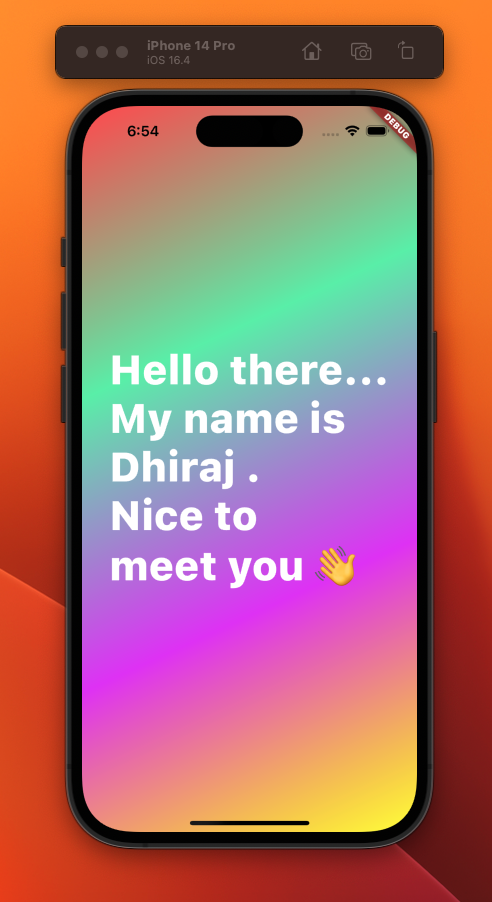

# hello_world
## Instruction

- enter command "flutter create hello_world"
- replace auto generated lib with this lib
- In main.dart, values in messageArray [messages ] & colorArray[ background ] will be shown in UI.

## EXAMPLE

const messageArray = [
        "Hello there...",
        "My name is",
        "Dhiraj .",
        "Nice to",
        "meet you 👋"
      ];

const colorArray = [
          Colors.redAccent,
          Colors.greenAccent,
          Colors.purpleAccent,
          Colors.yellowAccent
        ];

Demo for messageArray & colorArray : 

